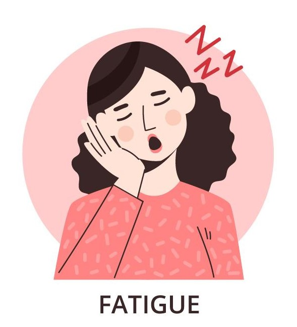
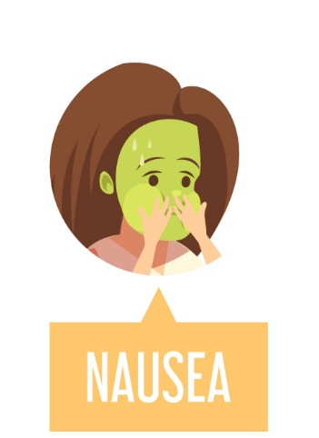

لو عايزة تعرفى انتى بالفعل حامل ولا لا - اكيد هتعملى اختبار حمل - لكن فى
بعض الاعراض المبدأية للحمل واللى بتحصل بس فى حالة الحمل - فى مقالتنا
النهاردة هنتعرف على اهم اعراض الحمل وازاى تعرفى اذا كنتى حامل ولا لأ من
غير اختبار الحمل فقط بالاعراض المصاحبة للحمل.

## هل كل الستات بتظهر عليها الاعراض دى يادكتور شمس؟

كل ست مختلفة عن التانية - بمعنى ان مش كل ست هتعانى من نفس الاعراض ولا بنفس الدرجة من حمل للتانى. دا كمان لان اعراض الحمل بتبقى مشابهة للاعراض اللى ممكن تواجهيها اثناء الدورة.

هنشوف دلوقتى اهم اعراض الحمل اللى ممكن تشعرى بيها وتظهر عليكى. لازم تعرفى ان الاعراض دى ممكن تظهر بسبب حاجات تانية بجانب الحمل, علشان كدا مش معنى ان الاعراض دى تبقى موجودة عندك انك اكيد ولازم تبقى حامل, الطريقة الوحيدة للتأكيد هى عن طريق **اختبار الحمل.**

## أولا: اختفاء الدورة

لاشك ان اكتر عرض واضح للحمل هو اختفاء البريود. بس مش كل الدورة ماتختفى يبقى السبب الحمل. فى اسباب تانية كتيرة لكن دا احد اهم الاعراض.

ممكن بردو تواجهى بعض النزيف اثناء الحمل. لو انتى حامل, اسالى الطبيب المعالج عن امتى النزيف يبقى طبيعى وامتى يبقى علامة طوارىء.

## ثانيا: ظهور قطرات دم والمغص

بعد الجماع, البويضة المخصبة بتمسك فى جدار الرحم, ودا ممكن يتسبب فى احد الاعراض المبدأية للحمل الا وهى ظهور بعض قطرات الدم Spotting واحيانا المغص

دا اسمه نزيف زرع البويضة المخصبة واللى بيحصل من 6 - 12 يوم بعد اخصاب البويضة.

المغص هنا شبه مغص البريود او الدورة, علشان كدا بعض الستات بتخطىء وبتقول ان دى دورة عادية - عموما النزول الدم والمغص هنا بيبقى قليل.

بجانب النزيف اللى بيحصل دا, بينزل سائل ابيض من المهبل واللى بيبقى معتمد هنا على سمك جدار المهبل. ودا بيحصل تقريبا بعد الجماع مباشرة. السائل دا الى ممكن يكمل لطول فترة الحمل غالبا غير ضار ومش محتاج اى علاج. بس لو فى رائحة كريهة او احساس بالحرقة والهرش, يبقى فى الحالة دى بتقولى للطبيب المعالج علشان دى احتمال تبقى عدوى بكتيرية او فطرية.

## ثالثا: تغيرات فى الثدى

تغيرات الثدى من العلامات الاولية للحمل, بيحصل تغييرات هرمونية سريعة بعد الجماع, وبسبب التغيرات الهرمونية دى, بيحصل زيادة فى حجم الثدى مع شعور بالالم بعدها باسبوع او اتنين. او ممكن حجم الثدى يكون اتقل مع الم عند اللمس. المنطقة اللى حوالين الحلمة اللى بنسميها Areola بتبقى داكنة اكتر.

طبعا فى حاجات تانية ممكن تسبب تغييرات فى الثدى لكن لو التغيرات دى متزامنة مع اعراض الحمل الاولية, هتاخدى عدة اسابيع علشان تتعودى علي المعدلات العالية للهرمونات -ولما دا يحصل, الام الثدى هتزداد شوية شوية

لكننا بنطمنك, دا طبيعى جدا وضرورى ان التغيرات الفسيولوجية دى تحصل - دا معناه ان جسمك بيستعد لايواء الجنين الجديد

## رابعا: التعب والارهاق

الشعور بانك تعبانة ومجهدة شىء طبيعى جدا فى الحمل وبيبدأ بدرى.

من الممكن انك تشعرى بالتعب الغير عادى بمجرد مرور اسبوع واحد فقط بعد الجماع.

ليه؟!

دا بيرجع للمعدلات العالية من هرمون البروجستيرون - على الرغم من ان حاجات تانية زى انخفاض السكر فى الدم وانخفاض ضغط الدم او زيادة كرات الدم الحمراء ممكن يتسبب فى دا

فى الحالة دى لازم انك تريحى جسمك وتاكلى اكل ملىء بالبروتين والحديد علشان يروح التعب دا.

## خامسا: الشعور بالغثيان

الشعور بالغثيان خصوصا الصبح من الاعراض اللى كتير من الستات الحوامل بتعانى منها, بس مش بالضرورة الكل. السبب الاساسى للـ Mornong Sickness مش معروف لكن هرمونات الحمل بتشارك بشكل رئيسى فى ظهور العرض دا.

الغثيان ممكن يحصل فى اى وقت من اليوم لكن بيبقى اكتر مايكون فى الفترات الاولى من الصباح.

بردو بعض الستات الحوامل مش بتطيق تاكل اكلات معينة اثناء الحمل ودا بردو بسبب التغيرات الهرمونية. تاثير دا ممكن يبقى قوى جدا لدرجة ان الاكلة المفضلة اللى بتحبيها ممكن متطيقيهاش تانى بعد كدا. لحسن الحظ الاعراض بتقل فى الاسبوع الـ 13 والاسبوع الـ 14 من الحمل.

فى الوقت الحالى لازم تاكلى اكل صحى ملىء بالفيتامينات علشان البيبى ينمو نمو صحى وانتى كمان ميحصلكيش اى مضاعفات او مشاكل اثناء الحمل.

فى زى ماقولنا اسباب تانية بجانب الحمل, لاختفاء الدورة. مثلا انك تخنتى فى وقت قليل او خسرتى وزن كبير فى وقت قليل. بالاضافة الى مشاكل الهرمونات والارهاق.

## اعراض اخرى مصاحبة للحمل

الحمل بيتسبب فى تغييرات هرمونية. دا ممكن يتسبب فى اعراض تانية زى:-

**- التبول الكتير.** دا بيبدا فى الاسبوع السادس او التامن عند كتيرمن الستات. على الرغم من ان دا ممكن يكون بسب التهاب فى مجرى البول UTI, السكر او استخدام مدرات البول Diuretics لو انتى حامل, دا بسبب التغيرات الهرمونية فى الاساس.

**- الامساك:** اثناء الحمل, المستويات العالية من هرمون البروجستيرون ممكن تتسبب لك فى حدوث امساك. دا لان هرمون البروجستيرون بيخلى الاكل يمر ببطىء فى الامعاء, علشان نسهل المشكلة, اشربى مايه كتير, اتمرنى, وكلى خضراوات وفواكه كتير.

**- تغيرات مزاجية:** بسبب التغيرات الهرمونية وبتحصل عموما فى التلت الاول فقط من الحمل.

**- صداع والام فى الظهر:** ستات كتير بتعانى من صداع والام فى الظهر خلال فترة الحمل.

**- دوار ودوخة:** ودى بسبب اتساع الاوعية الدموية, الضغط الواطى, والسكر الواطى.

الست الحامل ممكن تعانى من كل الاعراض دى, او ممكن تعانى من عرض واحد فقط او اتنين. لو اى عرض من دول سبب لك مشاكل تابعى مع الطبيب المعالج علشان يعمل خطة علاجية وتتخلصى من الاعراض دى.

## المصادر:

  <ul>
    <li>
      {" "}
      American Pregnancy Association: "Pregnancy Symptoms -- Early Signs of
    </li>
    <li>
      {" "}
      Pregnancy." Mayo Clinic: "Symptoms of Pregnancy: What Happens Right Away."
    </li>
    <li>
      {" "}
      SavingAngel.org: "Early Pregnancy Symptoms." Pregnancy Education: "Early
    </li>
    <li> Pregnancy Symptoms discharge, heartburn, nausea, and more."</li>
  </ul>

.png>)
